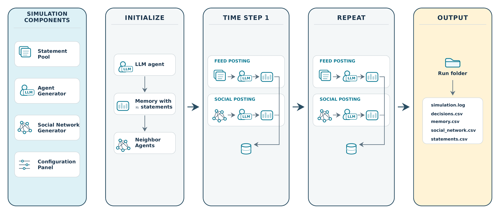

```{r}
#| echo: false
#| messages: false
library(tidyverse)
library(arrow)
```

## AI Augmented Deliberation

::: {.incremental}
- The vision of **deliberative democracy**: People with different preferences, *beliefs* and *values* exchange arguments $\to$ better solutions for societal problem.
- LLM Agents could help: Summary/Evaluation of Arguments, Negotiation, Finding common ground, ...
- Another Vision: Citizens have a digital twins doing deliberation work for them
:::

. . .

People deliberate $\to$ interaction $\to$ also *beliefs* and *values* (their **worldview**) may change 

. . .

[Simulate **worldview formation** with statements relatable to the **World Value Survey**]{.text-red}

## Building the Simulation



## 100 Statements from the WVS (Top 50)

```{r}
read_parquet("sttmts.parquet") |>
  arrange(desc(WVS_PC1)) |>
  mutate(Worldview_Statement = fct_inorder(Worldview_Statement)) |>
  slice(51:100) |>
  ggplot(aes(WVS_PC1, Worldview_Statement, fill = worldview)) +
  geom_col() +
  labs(x = "", y = "") +
  theme_minimal(base_size = 8)
```

::: aside
First principle components off all 97,220 WVS respondents 2018.   
In color: Progressive/Conservative coding by an LLM (not the simulation yet). 
:::

## 100 Statements from the WVS (cont.)

```{r}
read_parquet("sttmts.parquet") |>
  arrange(desc(WVS_PC1)) |>
  mutate(Worldview_Statement = fct_inorder(Worldview_Statement)) |>
  slice(1:50) |>
  ggplot(aes(WVS_PC1, Worldview_Statement, fill = worldview)) +
  geom_col() +
  labs(x = "", y = "") +
  theme_minimal(base_size = 8)
```

::: aside
First principle components off all 97,220 WVS respondents 2018.   
In color: Progressive/Conservative coding by an LLM (not the simulation yet). 
:::


## Network Example: t=100

```{=html}
<div id="network-root" class="network-mode--embedded" style="width: 100%; height: 500px;">
  <link rel="stylesheet" href="network-scoped.css">

  <div class="canvas-wrapper" id="canvas-wrapper">
    <svg class="graph-svg" id="graph"></svg>

    <div class="zoom-controls" id="zoom-controls">
      <button class="btn btn--zoom" id="btn-zoom-in" title="Zoom in">+</button>
      <button class="btn btn--zoom" id="btn-zoom-out" title="Zoom out">−</button>
    </div>

    <div class="cursor-tooltip" id="cursor-tooltip"></div>

    <div class="worldview-pane" id="worldview-pane">
      <div class="worldview-pane__header">
        <div class="worldview-pane__title" id="worldview-title"></div>
        <button class="worldview-pane__close" id="worldview-close">&#x2715;</button>
      </div>
      <div class="worldview-pane__list" id="worldview-list"></div>
    </div>

    <div class="worldview-pane" id="statement-pane">
      <div class="worldview-pane__header">
        <div class="worldview-pane__title" id="statement-title"></div>
        <button class="worldview-pane__close" id="statement-close">&#x2715;</button>
      </div>
      <div class="worldview-pane__list" id="statement-list"></div>
    </div>

    <div class="status-bar" id="status-bar">Initialising…</div>
  </div>
</div>

<script src="https://cdnjs.cloudflare.com/ajax/libs/d3/7.8.5/d3.min.js"></script>
<script src="network-core.js"></script>
<script src="network-embedded.js"></script>
<script>
document.addEventListener('DOMContentLoaded', () => {
  initEmbedded('canvas-wrapper', {
    file: 'networkjson/260328-1219_A100_M10_tmax100_op1_FS_seed400_gpt_t100.json',
    type: 'AS',
    zoom: 1.5,
    layout: { spread: 100, edgelen: 10, attract: 0.75 }
  });
});
</script>
```

## Statement Popularity

```{r}
read_parquet("stats_pop.parquet") |>
  pivot_wider(names_from = M, values_from = popularity) |>
  mutate(Total_pop = `5` + `10`) |>
  arrange(desc(Total_pop)) |>
  select(-Total_pop) |>
  slice(1:15) |>
  pivot_longer(c(`5`, `10`)) |>
  mutate(name = paste("Memory", name)) |>
  ggplot(aes(value, Worldview_Statement, fill = worldview)) +
  geom_col() +
  facet_wrap(~name) +
  labs(y = "", x = "") +
  theme_minimal()
```